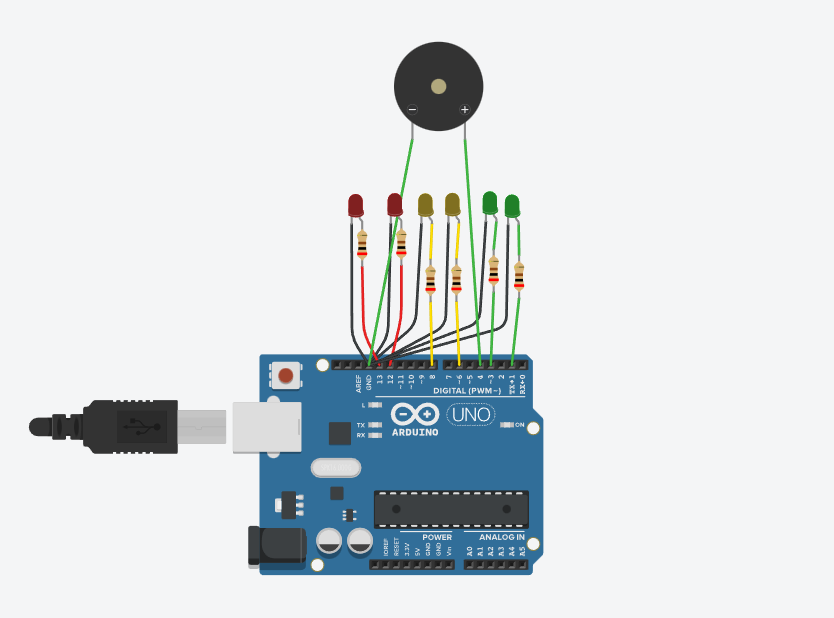
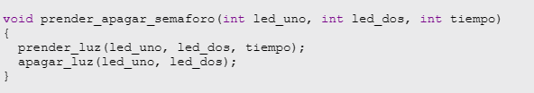

# Integrantes

- Barbizan	Franco
- García	Angeles Belen 
- Dopiralski	martin
- Costantini	Nicolas
- Espinoza	Fernando
- Fernández	Agustín

# Proyecto: Semafaro para no videntes.

# Descripción
Se desarrollo un semáforo para personas no videntes, que al estar en rojo emite una señal sonora para dar la advertencia de no cruzar. Al estar en amarillo o verde no suena dicha señal dándole a entender al peatón que puede cruzar.  

# Función principal

Esta función se encarga de encender y apagar los leds. Recibe como parámetros los leds que queremos prender y el tiempo que queremos que duren encendidas. Dentro se ejecutan dichas funciones con los parámetros que dimos previamente. 

# Link al proyecto 

- Barbizan	Franco : https://www.tinkercad.com/things/4zQzBDBJoe5-amazing-jaiks/editel?sharecode=eK_zyahVRuvKXtx5iRV-DLCYxDszXCJFaIqt6lND1IU

- García	Angeles Belen : https://www.tinkercad.com/things/dCAwvjqxFG9-copy-of-spd-angeles-belen-garcia-clase-2-ejercicio2-5/editel?sharecode=twt6y5QrDjUsAywyiegseosDuf9UHssMoV-2Rikc_sw

- Dopiralski	martin : https://www.tinkercad.com/things/9mGSZdzGrVV-copy-of-clase-2-ejercicio-4/editel?sharecode=kGCKjzJSbK3VLm1Wp0AoWtrlQbTCTca3awe8K8zgmFI

- Costantini	Nicolas : https://www.tinkercad.com/things/aRwxxjrkX0N-copy-of-nicolas-costantini-ej-2-5-clase-2-spd/editel?sharecode=WVUlkDQDEW7LZ7evJeYjH-iqIPCyfSY_5ZnxhjgRXTY

- Espinoza	Fernando : https://www.tinkercad.com/things/gUhVIP79IUL

- Fernández	Agustín : https://www.tinkercad.com/things/30CUyE0fQbE-copy-of-agustin-fernandez-2-5/editel?sharecode=Sg20dfxsCjN2FRNyp5_0iDHWZmPIJbE_-oBjh4fUymo
